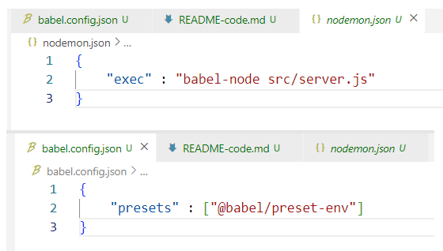
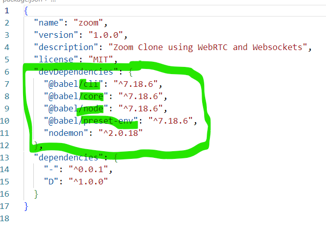

# 0.2. Node.js로 서버 만들기 (Server Setup) 
1. 프로젝트 생성 `npm init -y` (package.json 만드는 작업)
2. nodemon 설치 `npm i nodemon -D`
3. babel => 파일생성 `babel.config.json`
4. nodemon => 파일생성 `nodemon.json`
5. `src 폴더` 만들고 그 안에 `server.js` 생성하기
6. git init 해주고 
7. `npm i @babel/core @babel/cli @babel/node @babel/preset-env - D`
8. nodemon.json + babel.config.json => 각각 파일에 내용들 작성하기

`"exec" : "babel-node src/server.js"` => src/server.js에 대해 babel-node 명령문을 실행시키는 
<br>
이렇게 하고 package.json을 보면 다음과같이 설치가 잘 되어있음

<br>
9. package.json 가서 scrips 하나 만들고 dev : nodemon 추가할거임
```
이 의미가 : nodemon이 호출되면 => nodemon이 nodemon.json을 살펴보고 거기 있는 코드를 실행할거기 때문
10. express, pug 설치하기 `npm i express` `npm i pug`
11. server.js에 다음과 같은 코드 써주기 : 
```
import express from "express";

const app = express(); 

console.log("hello");

app.listen(3000);

이렇게 하고 `npm run dev` 하면 콘솔창에는 hello 뜨고, 웹으로 들어가서 localhost 3000 포트로 가보면 서버가 연결되었다는 표시를 볼 수 있음
Node.js로 서버 만들기 끝

# 0.3. FrontEnd Setup
